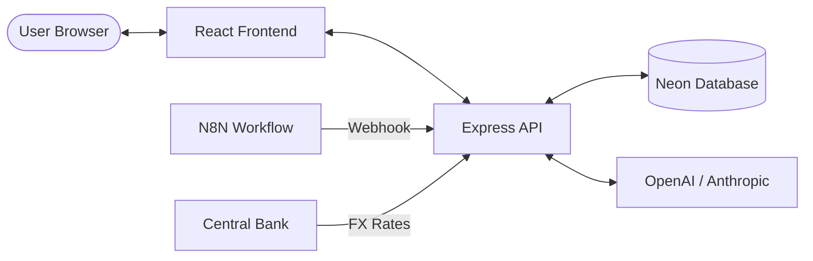

# Integration Architecture

This document describes how the different parts of the application communicate and integrate with external services.

## Internal Integration

The application follows a standard Client-Server architecture.

### 1. Frontend to Backend (HTTP/JSON)
The React frontend (`client/`) communicates with the Express backend (`server/`) primarily via REST-style API calls.

- **Technology:** `fetch` API wrapped in TanStack Query.
- **Data Format:** JSON.
- **Base Route:** `/api/*`
- **Authentication:** Session-based authentication using Passport.js. The session cookie is managed by the browser.

### 2. Shared Logic
A dedicated `shared/` directory contains code used by both the frontend and backend to ensure consistency.

- **Database Schema:** `shared/schema.ts` defines the types and structure for both Drizzle ORM (backend) and Zod validation (frontend).
- **Business Logic:** `shared/salaryCalculations.ts` contains the logic for 2025 and 2026 payroll calculations, ensuring that the frontend display matches the backend results.

## External Integration

The backend serves as an orchestration layer for several external integrations.

### 1. Database (Neon PostgreSQL)
- **Method:** Persistent connection via `drizzle-orm`.
- **Hosting:** Neon (Serverless PostgreSQL).
- **Purpose:** Primary persistence for customs, employees, and logistics data.

### 2. AI Services (OpenAI & Anthropic)
- **Method:** API calls via official SDKs.
- **Provider:** OpenAI (GPT models) and Anthropic (Claude models).
- **Purpose:** Power the AI Chat assistant for data querying and analysis.

### 3. N8N Webhook Receiver
- **Endpoint:** `POST /api/nakliye/webhook-receiver`
- **Method:** Inbound HTTP POST.
- **Purpose:** Receives structured data from N8N workflows that process transportation documents.

### 4. Currency Exchange (TCMB)
- **Method:** Periodic fetching/scraping from TCMB (Central Bank of the Republic of Turkey).
- **Location:** `server/currency.ts`
- **Purpose:** Provides current and historical exchange rates for expense calculations.

## Data Flow Diagram

