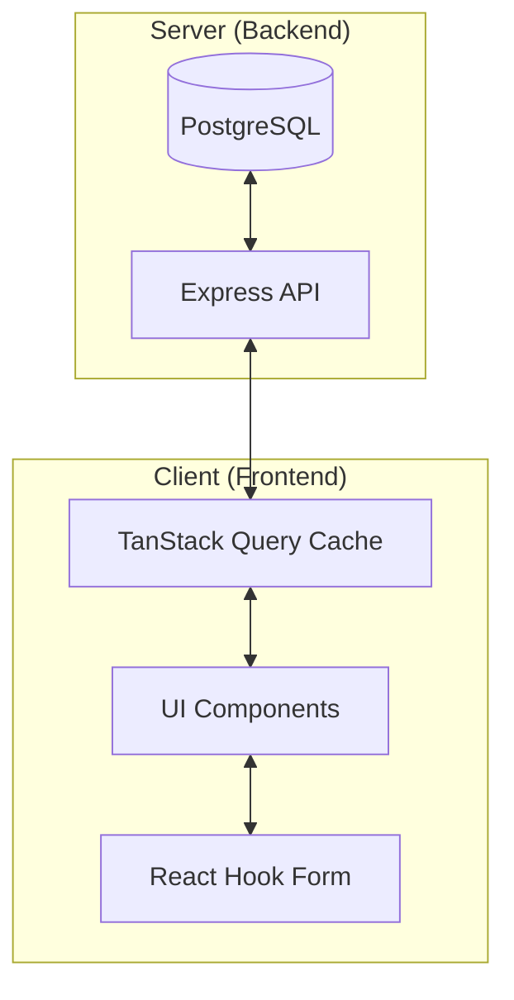

# State Management Patterns

This document describes how state is managed across the frontend application.

## Overview

The application follows a modern React state management approach, primarily relying on server-state synchronization rather than a heavy global client-side store like Redux.

## Primary Patterns

### 1. Server State (TanStack Query)
The main source of truth for all domain data (customs, employees, etc.) is handled by **TanStack Query** (React Query).

- **Location:** `client/src/lib/queryClient.ts`
- **Usage:** Custom hooks and direct `useQuery` calls in pages.
- **Benefits:** Handles caching, revalidation, loading states, and error handling automatically.
- **Mutations:** `useMutation` is used for all POST/PUT/DELETE operations, with explicit cache invalidation via `queryClient.invalidateQueries`.

### 2. Form State (React Hook Form)
All user inputs and data editing are managed through **React Hook Form**.

- **Validation:** Integrated with **Zod** for schema-based validation.
- **Location:** `client/src/components/ui/form.tsx` provides the wrapper around Radix UI elements.
- **Usage:** Extensive use in `Calisanlar.tsx`, `Gumruk.tsx`, and `Nakliye.tsx` for complex data entry.

### 3. Local UI State (React Hooks)
Transient UI state (modals open/closed, current tab, etc.) is managed using standard React `useState` and `useContext`.

- **Sidebar State:** Managed via `SidebarProvider` in `client/src/components/ui/sidebar.tsx`.
- **Theme state:** Managed via `next-themes` (ThemeToggle).

### 4. Routing State (Wouter)
The current navigation state is managed by **Wouter**.

- **Location:** `client/src/App.tsx`
- **Usage:** `Switch` and `Route` components for page navigation. `useLocation` hook for accessing the current path.

## Data Flow Diagram

## Best Practices
- **Prefer Server State:** If the data comes from the API, it should live in TanStack Query.
- **Controlled Forms:** Use `FormField` from the UI library to ensure consistent validation and state tracking.
- **Cache Invalidation:** Always invalidate relevant queries after a successful mutation to ensure the UI stays in sync with the database.
